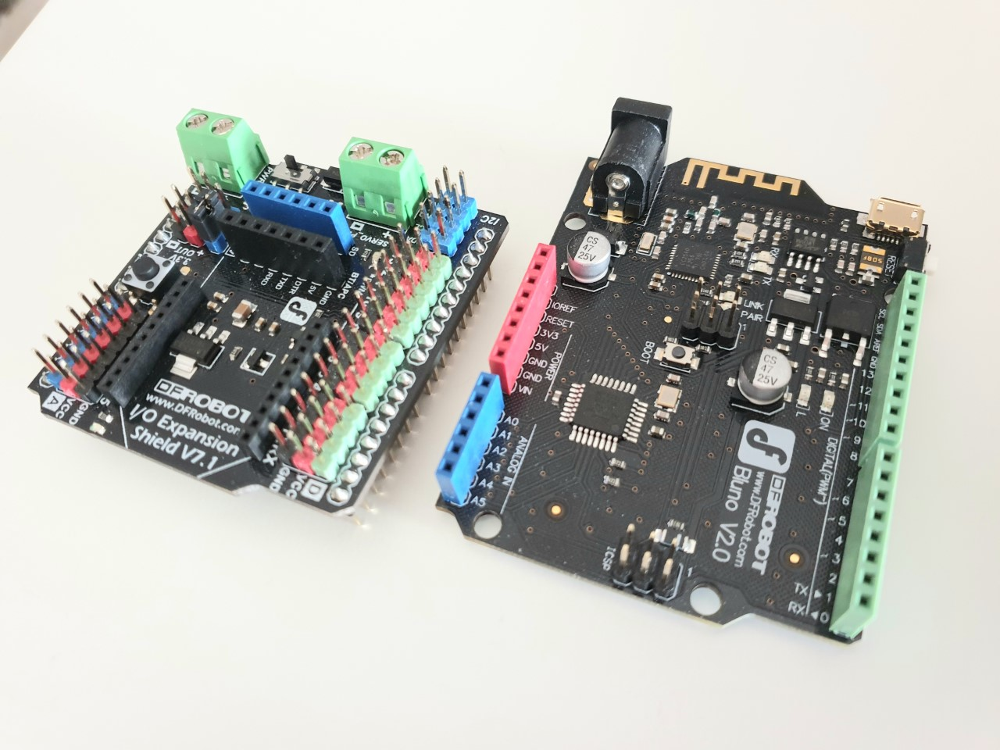
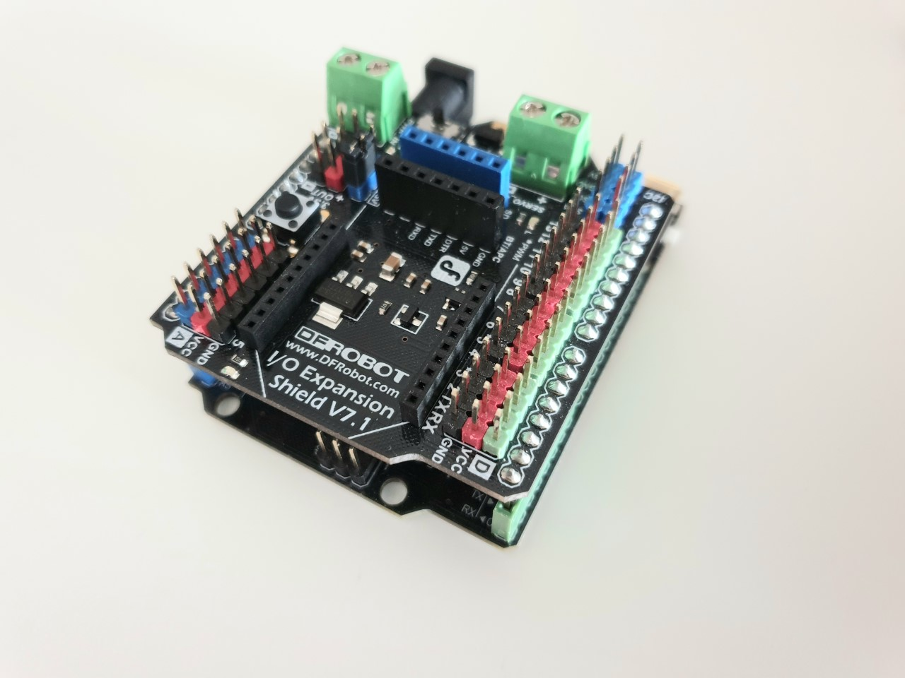
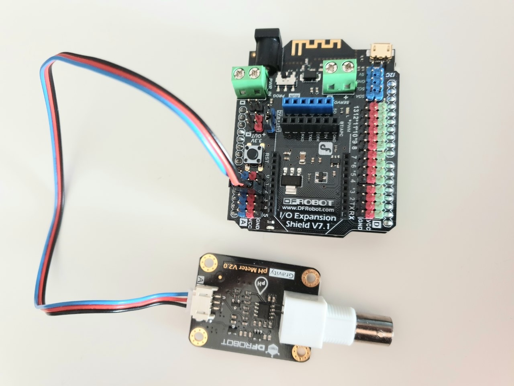
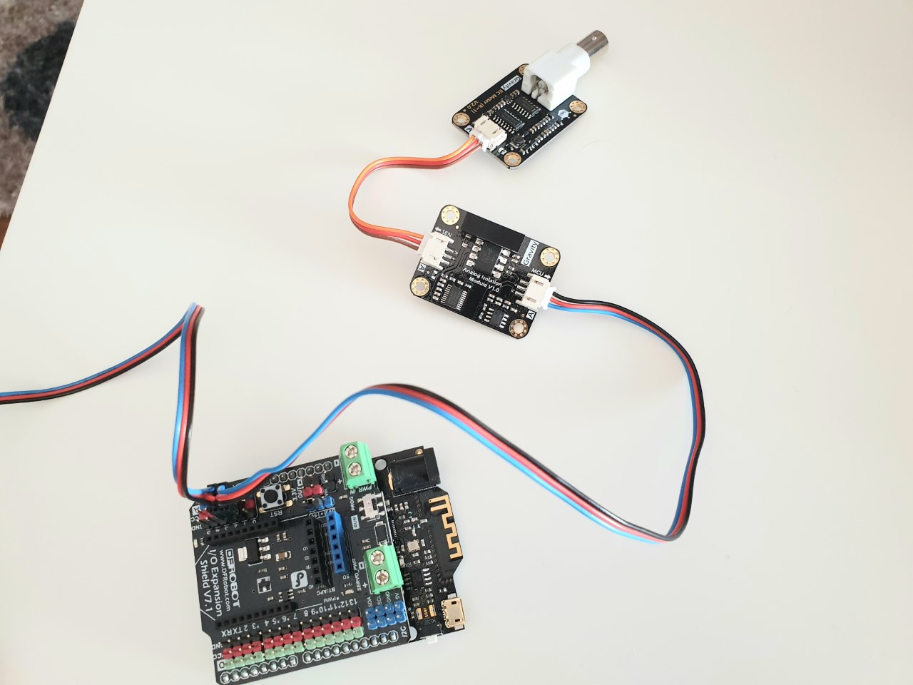
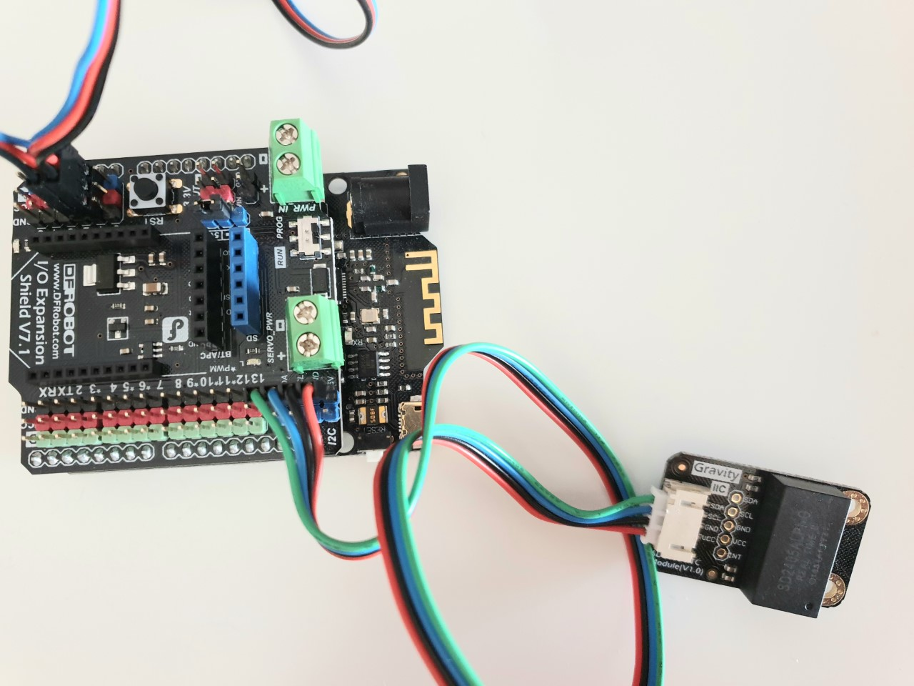
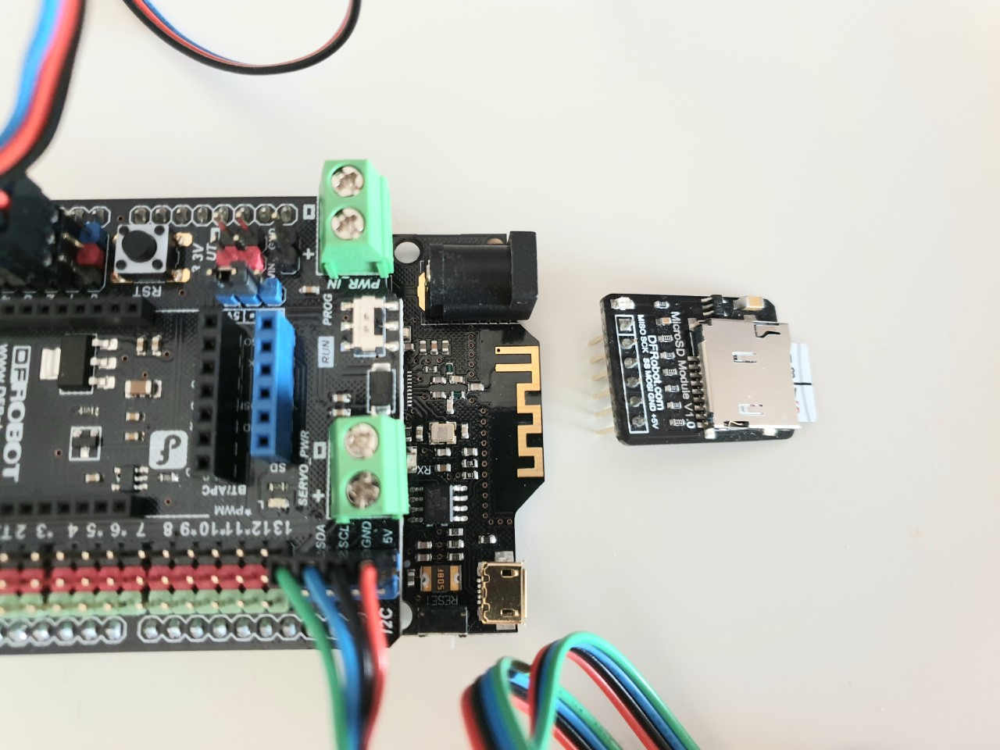
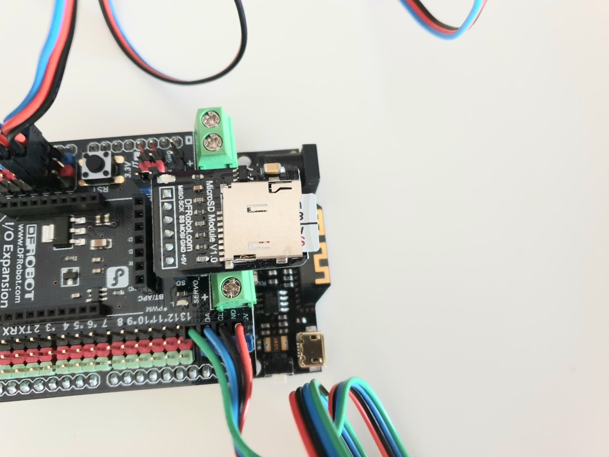
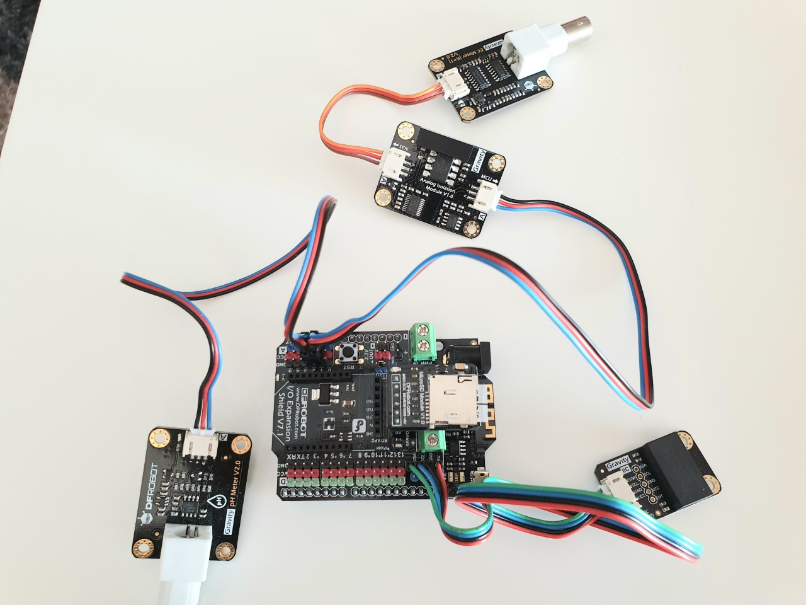

# Wiki measurements on Arduino Bluno

The Arduino Bluno board must meet two objectives: obtaining and processing data providing by the different modules and sharing these data with a Raspberry Pi via Bluetooth Low Energy (BLE). The first part here describes how to achieve the first objective.

#### Table of contents

- [1. Prepare the Arduino Bluno](#1-prepare-the-arduino-bluno)
- [2. Upload the code through Arduino IDE](#2-upload-the-code-through-arduino-ide)
- [3. Calibrating the probes](#3-calibrating-the-probes)
- [4. Precaution with the probes](#4-precaution-with-the-probes)

## 1. Prepare the Arduino Bluno

### Material needed :
* 1 Arduino Bluno (DFRobot Bluno = Uno + BLE integrated module)
* 1 IO Expansion Shield (DFRobot V7.1)
* 1 Real-Time Clock circuit board (RTC) and its I2C 4-Pin sensor cable
* 1 Micro-SD module
* 1 Micro-SD card
* 1 Analog Signal isolator and its analog cable
* 1 pH probe and its circuit board
* 1 EC probe and its circuit board
* 2 Analog sensor cables

As a first step, the project focuses on two sensors: a pH and EC probes. An analog signal isolator is added to avoid signal interference between the two sensors.

### Connecting all elements :
0. Add the IO expansion shield on the Arduino Bluno.  

1. Connect the pH module: plug the white end of the analog ("blue-red-black") cable to the pH data transfer board, and its black end to port A2 of the Bluno. The pH circuit board is now connected.  

2. Connect the EC module: plug the white end of the analog ("blue-red-black") cable to the analog signal isolator module (MCU side), and its black end to port A1.  
3. Plug one end of the "orange-red-black" cable to the EC circuit board, and the other end to the IN terminal of the isolation module (sensor side). The EC circuit board is now connected.  

4. Connect the Real-Time Clock (RTC) module: Plug the white end of the I2C 4-pins ("blue-green-red-black") cable to RTC, and its black end to the blue I2C interface.  

5. Connect the micro-SD card module to the blue SD card slot. When inserted, the SD card should be pointing outwards the Arduino.  

6. All sensors are connected.

> The probes here are not directly connected to preserve them when they are not used. The manufacturer advises to not plug the probes to their circuit boards for too long when the Arduino board is not powered. The code still works without connecting the probes.

## 2. Upload the code through Arduino IDE

### Material needed :
* Arduino IDE on your computer
* Arduino Bluno with all sensors connected (see above)
* 1 USB-micro USB cable which ALLOWS data transmission

### Steps :  
0. Open your Arduino IDE application.  
1. Open *WaterMonitor.ino* file in *WaterMonitor* folder.  
2. OneWire library may be missing. Go in Tools > Manage Libraries... and search for the OneWire library with its latest version.   
3. Connect the Arduino Bluno Board with the USB-micro USB cable to your computer. Select *Arduino Uno* in Tools > Board. The IDE may set automatically the port in Tools > Port, otherwise select the correct port. When connected, a red LED should be on (PWR).
4. Click on *Verify* button, and if successful on *Upload* button (icons just below File/Edit/Sketch in the upper left corner).  
5. Finally, open the Serial Monitor (icon in the upper right corner), set the baud rate to 9600 and, "BOTH NL & CR" option. It is recommended to check *Autoscroll* box for better readability.  
6. The measures and the current date should appear, they are directly saved on the SD card every 2 secs.  

## 3. Calibrating the probes

According to the manufacturer, the probes can reasonably be calibrated every month. When the Arduino Bluno board is powered and the Serial Monitor opened, the measurements take into account previous calibrated values by default. These values are indicated in first lines printed to Serial Monitor. Calibration can be made at any time, one probe at a time, as long as the code is working on the Arduino board and Serial Monitor is opened. As a precaution, connect the Arduino first and then connect the probes to their associated circuit boards. When finished, disconnect the probes first and then disconnect the Arduino board.

### How to enter in calibration mode

* ENTERPH: enters EC calibration mode.  
* CALPH: calibrates the EC probe when plunged into one of the buffer solutions (with a pH of 4 or 7). It automatically detects which solution is used.  
* EXITPH: quits the EC calibration mode and saves the calibrated values (only if all buffer solutions have been used !).  

* ENTEREC: enters EC calibration mode.  
* CALEC: calibrates the EC probe when plunged into one of the buffer solutions (with EC of 1413 µS/cm or 12.88 mS/cm). It automatically detects which solution is used.  
* EXITEC: quits the EC calibration mode and saves the calibrated values (only if all buffer solutions have been used !).  

> Note: if only one buffer solution has been used, or if EXIT-- command have not been sent, calibration will fail.  

## 4. Precaution with the probes

* As a precaution, connect the Arduino first and then connect the probes to their associated circuit boards. When finished, disconnect the probes first and then disconnect the Arduino board.  
* Preferably connect the probes only when needed (measurements or calibration) to extend their lifetime.  
* The pH probe terminal should always be immersed in the liquid initially contained in its protective cap.  
* If the pH probe is immersed in a buffer solution, this solution may become contaminated and unusable thereafter, as the pH probe is sensitive to impurities.   
* Use distilled water to rinse the probes, before and after any test in any solution.

TO DO: add photos for each step, talk about precautions to have with probes, how to connect the Arduino and which steps to obtain the measurements/the calibration.

